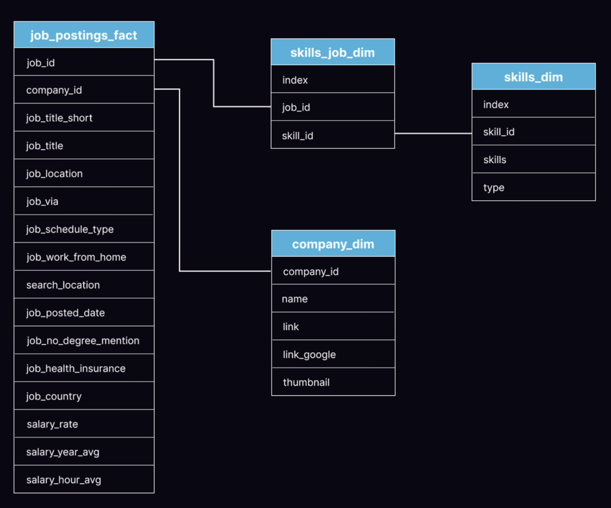
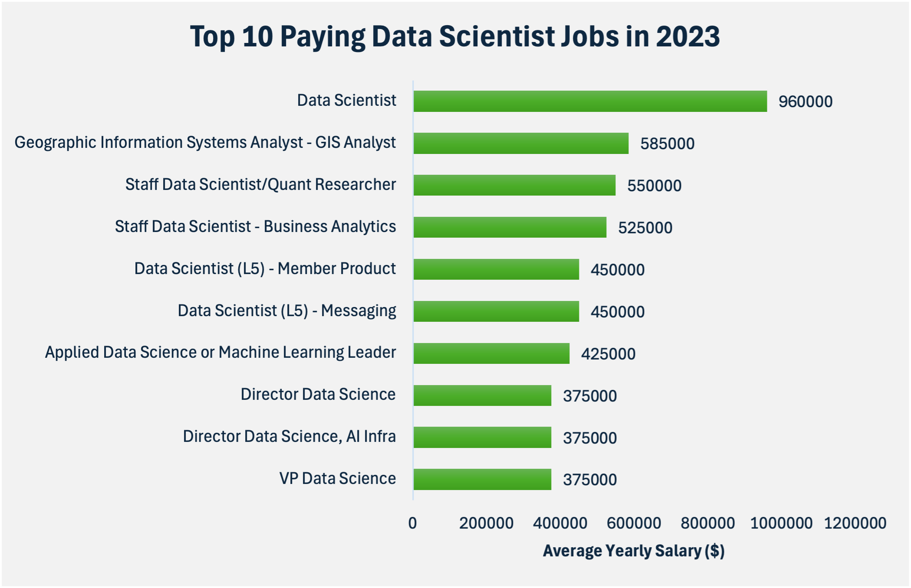
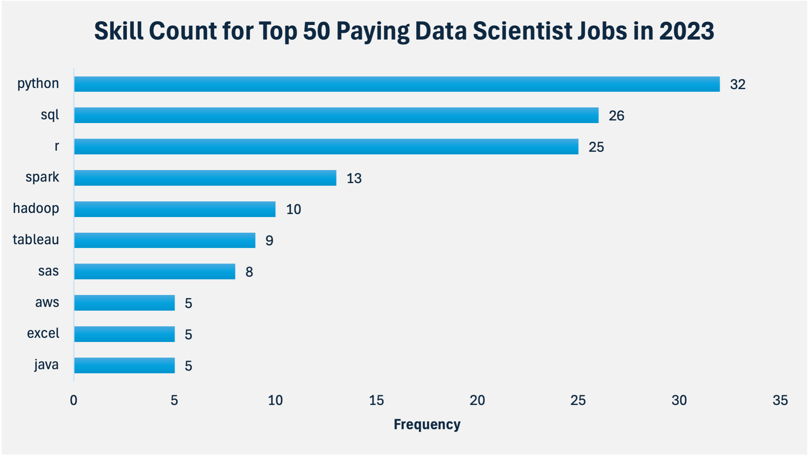

# Introduction
📊 Dive into the data job market! Focusing on data scientist roles, this project explores 💰 top-paying jobs, 🔥 in-demand skills, and 📈 where high demand meets high salary in data scientist.

🔍 SQL queries? Check them out here: [sql_project folder](/sql_project/)

# Background
Driven by a quest to navigate the data scientist job market more effectively, this project was born from a desire to pinpoint top-paid and in-demand skills, streamlining others work to find optimal jobs.

Data hails from [SQL Course](https://www.lukebarousse.com/sql). It's packed with insight on job titles, salaries, locations, and essential skills. Here's the ERD from the dataset:



### 🔍 The questions that I wanted to answer through my SQL queries were:
1. What are the top-paying data analyst jobs?
2. What skills are required for these top-paying jobs?
3. What skills are most in demand for data analysts?
4. Which skills are associated with higher salaries?
5. What are the most optimal skills to learn?

# Tools I Used
For my deep dive into the data scientist job market, I harnessed the power of several key tools:

- **SQL:** The backbone of my analysis, allowing me to query the database and unearth critical insights.
- **PostgreSQL:** The chosen database management system, ideal for handling the job posting data.
- **Visual Studio Code:** My go-to for database management and executing SQL queries.
- **Git & GitHub:** Essential for version control and sharing my SQL scripts and analysis, ensuring collaboration and project tracking.
- **Excel:** Create simple visualizations from query results.

# The Analysis
Each query for this project aimed at investigating specific aspects of the data scientist job market. Here’s how I approached each question:

### 1. Top Paying Data Scientist Jobs
To identify the highest-paying roles, I filtered data scientist positions by average yearly salary. And also I filtered across all locations to get all the data for the data scientist role in the dataset. This query highlights the high paying opportunities in the field.

```sql
SELECT
    job_id,
    job_title,
    job_location,
    job_schedule_type,
    salary_year_avg,
    job_posted_date,
    name AS company_name
FROM
    job_postings_fact
LEFT JOIN company_dim ON job_postings_fact.company_id = company_dim.company_id
WHERE
    job_title_short = 'Data Scientist' AND
    job_location IS NOT NULL AND
    salary_year_avg IS NOT NULL
ORDER BY
    salary_year_avg DESC
LIMIT 10;
```

*Bar graph visualizing the salary for the top 10 salaries for data scientist; I used Excel for created this graph from my SQL query results*

Here's the breakdown of the top data scientist jobs in 2023:
- **Wide Salary Range:** Top 10 paying data scientist roles span from $375,000 to $960,000 which indicating significant salary potential in this field
- **Job Title Variety:** There's a high diversity in job titles, from Data Scientist to Director Data Sience, reflecting varied roles and specializations within data scientist.

### 2. Skills for Top Paying Jobs
To understand whats skills are requred for the top-paying jobs, I joined the job postings fact table with skills data table, providing insights into what employers value for high-compensation roles.

```sql
WITH top_paying_jobs AS (
    SELECT
        job_id,
        job_title,
        salary_year_avg,
        job_location,
        name AS company_name
    FROM
        job_postings_fact
    LEFT JOIN company_dim ON job_postings_fact.company_id = company_dim.company_id
    WHERE
        job_title_short = 'Data Scientist' AND
        job_location IS NOT NULL AND
        salary_year_avg IS NOT NULL
    ORDER BY
        salary_year_avg DESC
    LIMIT 50
)

SELECT 
    top_paying_jobs.*,
    skills
FROM top_paying_jobs
INNER JOIN skills_job_dim ON top_paying_jobs.job_id = skills_job_dim.job_id
INNER JOIN skills_dim ON skills_job_dim.skill_id = skills_dim.skill_id
ORDER BY
    salary_year_avg DESC;
```

*Bar graph visualizing the count of skills for the top 10 paying jobs for data data scientist; I used Excel for created this graph from my SQL query results*

Here's the breakdown of the most demnaded skills for the top 50 highest paying data scientist jobs in 2023:
- **Python** is leading with a boled count of 32.
- **SQL** follows closely with a bold count of 26.
- **R** is also highly sought after, with a bold count of 25. Other skills like **Spark**, **Hadoop**, **Tableau**, **SAS**, **AWS**, **Excel**, and **Java** show varying degrees of demand.

### 3. In-Demand Skills for Data Scientist
This query helped identify the skills most frequently requested in job postings, directing focus to areas with high demand.
```sql
SELECT
    skills,
    count(skills_job_dim.job_id) AS demand_count
FROM
    job_postings_fact
INNER JOIN skills_job_dim ON job_postings_fact.job_id = skills_job_dim.job_id
INNER JOIN skills_dim ON skills_job_dim.skill_id = skills_dim.skill_id
WHERE
    job_title_short = 'Data Scientist' AND
    job_location IS NOT NULL AND
    salary_year_avg IS NOT NULL
GROUP BY
    skills
ORDER BY
    demand_count DESC
LIMIT 5;
```

**Table of the demand for the top 5 skills in data scientist job postings**
| Skill   | Demand Count |
|---------|--------------|
| Python  | 4,261        |
| SQL     | 3,114        |
| R       | 2,463        |
| Tableau | 1,262        |
| SAS     | 1,226        |

Here's the breakdown of the most demanded skills for data scientist in 2023:
- **Python and SQL remain foundational:** Python leads with the highest demand (4,261 job listings), confirming its position as the core programming language for data manipulation, modeling, and automation. SQL, essential for data querying, follows closely, making both must-have skills.
- **R and SAS show continued relevance in analytics-heavy roles:** While Python dominates, R (2,463) and SAS (1,226) still maintain strong demand, especially in sectors like healthcare, academia, or government where statistical analysis and legacy systems are prevalent.
- **Tableau reflects the growing need for data storytelling:** With 1,262 listings, Tableau underscores the increasing emphasis on data visualization and the ability to communicate insights effectively to non-technical stakeholders.

### 4. Skills Based on Salary

```sql
SELECT
    skills,
    round(avg(salary_year_avg), 0) AS avg_salary_year
FROM
    job_postings_fact
INNER JOIN skills_job_dim ON job_postings_fact.job_id = skills_job_dim.job_id
INNER JOIN skills_dim ON skills_job_dim.skill_id = skills_dim.skill_id
WHERE
    job_title_short = 'Data Scientist' AND
    job_location IS NOT NULL AND
    salary_year_avg IS NOT NULL
GROUP BY
    skills
ORDER BY
    avg_salary_year DESC
LIMIT 10;
```
**Table of the average salary for the top 10 skills in data scientist**
| Rank | Skills         | Average Salary (USD/year) |
|------|----------------|---------------------------|
| 1    | Asana          | 215,477                   |
| 2    | Airtable       | 201,143                   |
| 3    | RedHat         | 189,500                   |
| 4    | Watson         | 187,417                   |
| 5    | Elixir         | 170,824                   |
| 6    | Lua            | 170,500                   |
| 7    | Slack          | 168,219                   |
| 8    | Solidity       | 166,980                   |
| 9    | Ruby on Rails  | 166,500                   |
| 10   | RShiny         | 166,436                   |

Here's the brekadown of the result for top paying skills for Data Scientist:
- **High-paying data science roles often require cross-functional or niche technical skills —** such as DevOps, MLOps, Web3, or building data products — beyond just modeling and statistics.
- **Tools that improve collaboration, deployment, or automation (e.g., Asana, RedHat, RShiny)** signal your readiness to contribute to end-to-end data workflows — a key factor in higher salaries.
- **Rare or domain-specific skills (e.g., Solidity, Elixir, Lua)** can significantly boost pay due to **low competition and high demand** in specialized industries like blockchain, gaming, or enterprise AI.

### 5. Most Optimal Skills to Learn

```sql
SELECT
    skills_dim.skills,
    count(skills_job_dim.job_id) AS demand_count,
    round(avg(job_postings_fact.salary_year_avg), 0) AS avg_salary_year
FROM
    job_postings_fact
INNER JOIN skills_job_dim ON job_postings_fact.job_id = skills_job_dim.job_id
INNER JOIN skills_dim ON skills_job_dim.skill_id = skills_dim.skill_id
WHERE
    job_title_short = 'Data Scientist' AND
    job_location IS NOT NULL AND
    salary_year_avg IS NOT NULL
GROUP BY
    skills_dim.skill_id
HAVING
    count(skills_job_dim.job_id) > 10
ORDER BY
    demand_count DESC
LIMIT 10;
```

**Table of the most optimals skills for data scientist sorted by salary**
| Rank | Skills      | Demand Count | Average Salary (USD/year) |
|------|-------------|---------------|-----------------------------|
| 1    | Python      | 4261          | 137,919                     |
| 2    | SQL         | 3114          | 138,400                     |
| 3    | R           | 2463          | 135,135                     |
| 4    | Tableau     | 1262          | 131,219                     |
| 5    | AWS         | 1005          | 138,924                     |
| 6    | Spark       | 938           | 144,053                     |
| 7    | TensorFlow  | 635           | 143,207                     |
| 8    | Azure       | 615           | 132,979                     |
| 9    | Excel       | 614           | 124,753                     |
| 10   | SAS         | 613           | 122,968                     |

Here's a breakdown of the most optimal skills for Data Scientist in 2023:
- **Python, SQL, and R** are the **core foundational skills** for data scientist - they offer **high demand and strong salaries,** making them optimal for both beginners and experienced professionals.
- **Cloud and big data tools** like **AWS, Spark, and TensorFlow** offer **higher average salaries** and reflect the growing importance of scalable data processing and machine learning in real-world applications.
- Tools like **Excel and SAS**, though still in use, offer **lower salaries and demand**, indicating they may be less future-proof compared to newer technologies.

# What I Learned
Throughout this adventure, I've turbocharged my SQL toolkit with some serious firepower:

- **🧩 Complex Query Crafting:** Mastered the art of advanced SQL, merging tables like a pro and wielding WITH clauses for ninja-level temp table maneuvers.
- **📊 Data Aggregation:** Got cozy with GROUP BY and turned aggregate functions like COUNT() and AVG() into my data-summarizing sidekicks.
- **💡 Analytical Wizardry:** Leveled up my real-world puzzle-solving skills, turning questions into actionable, insightful SQL queries.

# Conclusions

### Insights
From the analysis, several general insights emerged:

1. **Top Paying Data Scientist Jobs:** The wide salary range and diverse job titles in data science highlight the field’s vast career potential and opportunities for specialization across different levels and domains.
2. **Skilss for Top-Paying Jobs:** Python, SQL, and R consistently emerge as the most in-demand skills among top-paying data science roles, underscoring their foundational importance across diverse analytics and engineering tasks.
3. **Most In-Demand Skills:** Foundational tools like Python and SQL dominate demand, while R, SAS, and Tableau highlight the continued importance of statistical analysis and effective data storytelling in specialized and communication-driven roles.
4. **Skills with Higher Salaries:** High-paying data science roles reward professionals who possess niche or cross-functional skills—especially in deployment, collaboration, and specialized domains—demonstrating the value of contributing to full-cycle data solutions beyond core analytics.
5. **Optimal Skills for Job Market Value:** Mastering core languages like Python, SQL, and R provides a strong foundation, but advancing into cloud and big data tools like AWS, Spark, and TensorFlow is key to unlocking higher salaries and future-proofing a data science career.

### Closing Thoughts
This project enhanced my SQL skills and provided valuable insights into the data scientist job market. The findings from the analysis serve as a guide to prioritizing skill development and job search efforts. Aspiring data scientist can better position themselves in a competitive job market by focusing on high-demand, high-salary skills. This exploration highlights the importance of continuous learning and adaptation to emerging trends in the field of data scientist.